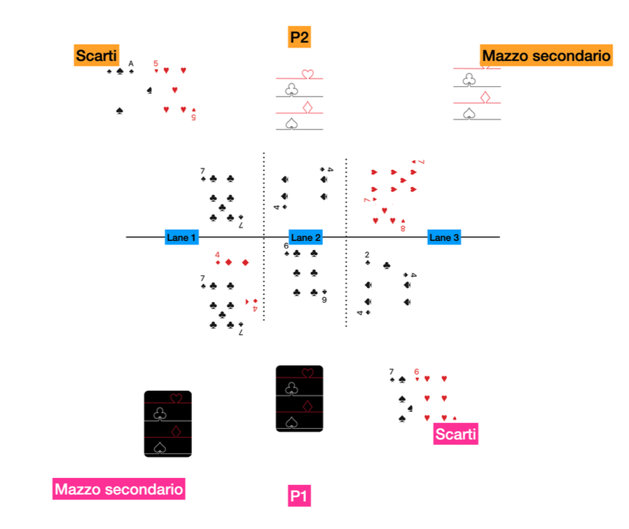

# Regolamento
## Layout e turni

Il mazzo principale va tenuto sempre al centro; alla destra andranno gli scarti a faccia in su e alla destra le carte che costituiranno il mazzo secondario.

La partita si compone di 15 turni (vedi [Condizioni di Vittoria](#condizioni-di-vittoria)). I giocatori si alternano su chi inizia. P1 é il primo giocatore ad iniziare la partita; P1 iniziariá sempre i turni dispari e P2 i turni pari.

Ogni turno prevede la fase di piazzamento (🎴); poi ci sono fasi di combattimento (⚔️) e fasi di spostamento (🔁). Per maggiori dettagli [Fasi di Gioco](#fasi-di-gioco).

|   Turno | Chi inizia - Fasi   |
| -----| ------------ |
| `1`| P1  -  🎴 |
| `2`| P2  -  🎴 |
| `3`| P1  -  🎴 |
| `4`| P2  -  🎴 > ⚔️   |
| `5`| *(apertura Lane 3)* P1  -  🎴   |
| `6`| P2   -  🎴 > ⚔️ > 🔁    |
| `7`| P1  -  🎴 |
| `8`| P2  -  🎴 > ⚔️ |
| `9`| P1  -  🎴 > 🔁 |
| `10`| P2  -  🎴 > ⚔️ |
| `11`| P1  -  🎴 |
| `12`| P2  -  🎴 > ⚔️ > 🔁 |
| `13`| P1  -  🎴 > ⚔️ > 🔁 |
| `14`| P2  -  🎴 > ⚔️ > 🔁 |
| `15`| P1  -  ⚔️ |
| ...| P1/P2  -  🎴 > ⚔️ > 🔁  |

## Lane e target di lane
Il gioco si sviluppa su tre lane, identificate come lane 1, lane 2 e lane 3. Come da layout, la lane 1 é sempre quella alla sinistra del giocatore 1 (P1), mentre la lane 2 é sempre quella centrale.

Ad inizio gioco, tutte le lane hanno **target 21**. 

Fino al turno quarto, si possono giocare carte solo in lane 1 e lane 2; la lane 3 si apre alla fine del quarto turno.

É importante tenere controlato il valore della propria lane perché se in fase di combattimento si supera il target, si rischia di sballare.

!!! warning "Attenzione"
    Ci sono poteri come [♣️ Inflazione](./Potere%20dei%20Semi.md/#c4-inflazione) che modificano temporaneamente il target di lane. Fai attenzione!

Non vi é limite di carte per lane

## Condizioni di vittoria
Vince il giocatore che:

- per primo raggiunge i 15 punti, o:
- ha piú punti alla fine del 15esimo turno

Se entrambe i giocatori superano i 15 punti perima del quindicesimo turno, si guarda chi ha piú punti. In caso di pareggio, si continua con la normale turnazione finché la situazione di pareggio non si risolve.

In caso di pareggio alla fine del quindicesimo turno, si continua con turni extra completi (piazzamento, combattimento, spostamento) finché si risolve la situazione di paritá.

## Fasi di Gioco
Vi sono 3 fasi di gioco distribuite su diversi turni, in quest'ordine di svolgimento:

- Piazzamento
- Combattimento
- Spostamento

La fase di piazzamento si fa all'inizio di ogni turno. I giocatori si alternano su chi inizia per primo.

La prima fase di combattimento é alla fine del 4 turno e poi ogni due turni.

La prima fase di spostamento é alla fine del 6 turno e poi ogni tre turni.

Durante il turno 12, 13, 14 ci sono tutte e tre le fasi, nell'ordine descritto sopra.

Durante il turno 15, vi é solo la fase di combattimento.

A seguire l'ordine cronologico dei turni.

1. **Piazzamento**
    1. Pescare
    2. Giocare una carta su una lane
    3. Giocare una carta nel mazzo degli scarti
    4. Giocare una carta nel mazzo secondario
    5. Rivelazione carte
 1. Risoluzione eventuali effetti
2. **Combattimento**
    1. Entrata in combattimento
    2. Calcolo punteggio
 1. Calcolo effetti
 2. Somma punti delle lane 
 3. Si verifica chi sballa
    4. Fine combattimento
    5. Assegnazione punti
3. **Spostamento**
    1. Scelta carte
    2. Rivelazione carte
    3. Spostare le carte

### Piazzamento

#### Pescare e giocare le carte
Ogni giocatore pesca tre carte. Dopodiché, ad ogni turno i giocatori si alteranano su chi inizia per primo (P1 e P2). P1 quindi gioca una carta coperta su una lane e P2 esegue la stessa azione. Poi una carta va giocata nel mazzo degli scarti ed infine una carta nel mazzio secondario.

Se non c'é possibilitá di giocare una carta su nessuna lane, quella carta va giocata nel mazzo degli scarti.

Finché ci sono carte, si pesca sempre fino a raggiungere tre carte in mano; se se ne pescano di mano, le carte vanno giocate nell'ordine: Lane > Scarti > Secondario

Qualora all'inizio del turno non ci siano carte nel mazzo principale, il giocatore deve scegliere tra:

- Usare il mazzo secondario come mazzo principale; di fatto il mazzo secondario diventa il mazzo principale. Il mazzo secondario viene fisicamente spostato al centro.

- Mischiare gli scarti con il mazzo secondario ed avere quindi un nuovo mazzo principale.

#### Rivelazione delle carte
Le carte giocate a faccia in giú nelle lane vengono rivelate in contemporanea; se le carte girate hanno effetti, si risolvono ora.

Qualora le due carte abbiano effetti contrastanti, come [♦️Pilastro](./Potere%20dei%20Semi.md/#d3-pilastro) e [♠️Ghigliottina](./Potere%20dei%20Semi.md/#s3-ghigliottina), si attiva per prima la carta del giocatore che:

- ha il punteggio di lane piú vicino al target di lane escludendo le carte appena rivelate. Se per esempio il target é 21 e la somma dei valori di P1 é 17 e P2 é 20, la carta di P2 si attiva per prima. In caso di pareggio:

- si attiva la carta del giocatore con il punteggio più vicino al target calcolando anche il valore della carta appena rivelata. In caso di pareggio:

- le carte vengono considerate neutre e non si attiva nessun effetto.

### Combattimento
Il primo  combattimento avviene alla fine del quarto turno e si ripete ogni due turni. Si combatte sempre al turno 13 e 15.

Anche se la fase di combattimento é immediata (si sommano i valori e si controlla chi vince la lane senza sballare), é importante rispettare l'ordine descritto sopra perché diversi poteri si attivano durante diverse fasi del combattimento. Per esempio, l'effetto [❤️Paracadute](./Potere%20dei%20Semi.md/#h2-paracadute) si attiva entrando in combattimento mentre [❤️Seconda Chance](./Potere%20dei%20Semi.md#h4-seconda-chance) si attiva solo quando si sballa.

#### Assegnazione punti
Una lane alla volta, partendo dalla lane 1, i giocatori risolvono eventuali effetti di combattimento e poi sommano i valori delle proprie carte: il giocatore piú vicino al target di lane senza sballare vince.

- Chi vince la lane, guadagna un punto
- Se il punteggio di lane é uguale al target, guadagna 2 punti
- In caso di pareggio, entrambe i giocatori fanno un punto
- Se un giocatore sballa, l'avversario guadagna un punto extra

I punti si sommano tutti insieme alla fine del combattimento e non di lane in lane.

## Chiarimenti sulle fasi di gioco
Si guarda se un giocatore sballa solo durante la fase di combattimento dedicata; durante le altre fasi si puó avere qualsiasi punteggio.

Durante la fase di piazzamento, le carte si rivelano in contemporanea ma i giocatori si alternano su chi gioca la carta per primo sulla lane.

La fase di spostamente é sempre dopo la fase di combattimento.

