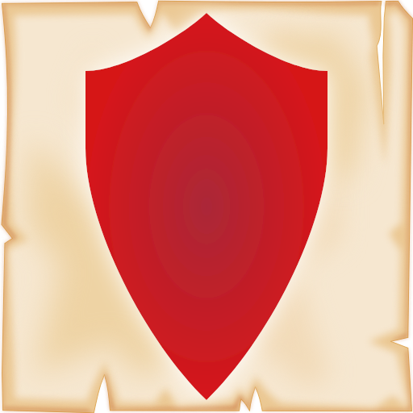
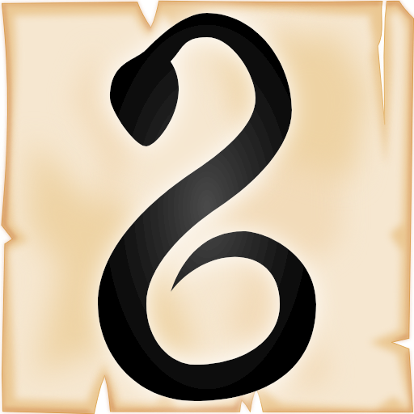
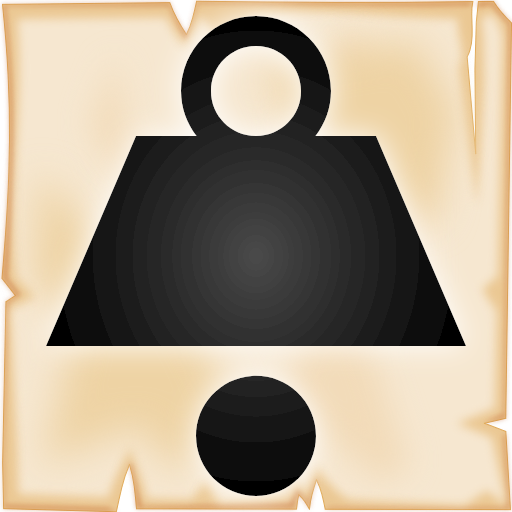
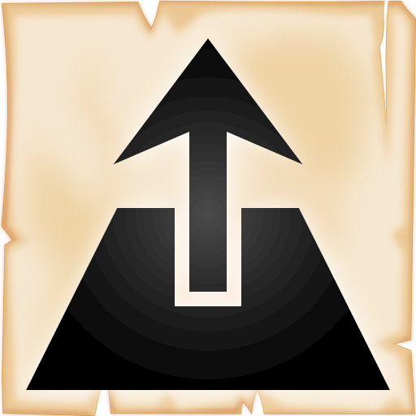
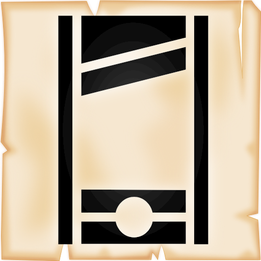
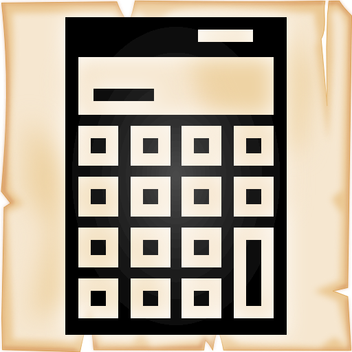
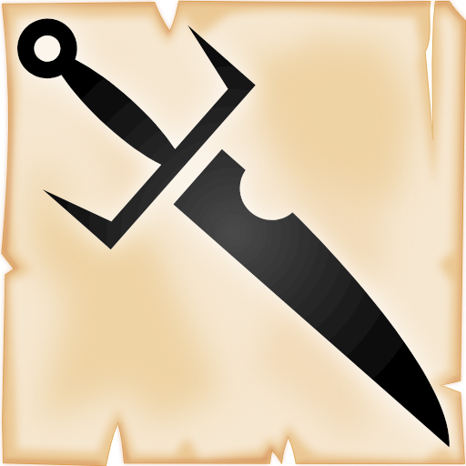

# Suits' Powers
Players must pick a power for each suit from the list below. Only one power per suit.

Players must declare the picked powers.

Each powers has a code and a name for identification.

Before checking out each power, we need to talk about neutral cards: they are cards that have already activated their power and only their value is taken in account. To easily identify them, they are rotated by 90 degree (*tapped* if you are familiar with Magic).

!!! Note "Check the bell 🔔"
    The bell tells at what phase the powers activate its effects.

## ❤️ Hearts ❤️ 
Hearts allow you to manage your resources and protect your score.
### { width="32" height="32" style="vertical-align: middle; margin-right: 8px;" } H1 - Usual Healing
When this card is revealed, take the your last card in this lane and move it to the **secondary deck**.

If this effect cannot be activated (e.g. there are no cards in your lane or they are under the effect of [♦️Pillar](#d3-pillar)) play this card neutral.

After activating this effect, this card becomes neutral.

🔔: *Placing - Reveal the played cards*

### { width="32" height="32" style="vertical-align: middle; margin-right: 8px;" } H2 - Parachute
If the score of your lane is higher than the target when entering combat, start the combat with a score of 15 instead. At the end of the combat, the score goes back to the original score and this card becomes neutral.

This effect applies for every ❤️ card in your lane

🔔: *Combat - Entering the combat*

### { width="32" height="32" style="vertical-align: middle; margin-right: 8px;" } H3 - Life Recycling
When this card is revealed, swap this card with a card in your secondary deck with the value equal to than less of this card. Activate the effects of the swapped card.

This power activates only if it is played from your hand. If played from any other source, this card is neutral.

This power does not activate if there is an ❤️ already in your lane, this card becomes neutral.

🔔: *Placing - Reveal the played cards*

### { width="32" height="32" style="vertical-align: middle; margin-right: 8px;" } H4 - Second Chance
If you bust, discard this card and recalculate the score of your lane.

If there is an ❤️ already in your lane. This card become neutral instead.

🔔: *Combat - Bust checks*

### { width="32" height="32" style="vertical-align: middle; margin-right: 8px;" } H5 - Nullify
Turn an opponent's card in this lane that has the same value as this card neutral (including the card just revealed by the opponent). Then, discard this card.

If there is no card with the same value, this card becomes neutral.

🔔: *Placing - Reveal the played cards*

## ♦️ Diamonds ♦️
Diamonds powers help you by protecting your lane and manipulate it.

### { width="32" height="32" style="vertical-align: middle; margin-right: 8px;" } D1 - Steel Shield
When this card is revealed, cards in this lane, for both you and your opponent, cannot be moved or destroyed, and the lane score cannot be modified. This effect last until the end of the next combat, after which that turn this card neutral.

If there is another active ♦️ on your lane, this card becomes neutral.

🔔: *Placing - Reveal the played cards*

### { width="32" height="32" style="vertical-align: middle; margin-right: 8px;" } D2 - Mirage
If the value of this card is lower than the card revealed by the opponent, you can move this card at the bottom of another lane.

Regardless of whether this effect activates or not, turn this card neutral.

🔔: *Placing - Reveal the played cards*

### { width="32" height="32" style="vertical-align: middle; margin-right: 8px;" } D3 - Pillar
This card cannot be moved or destroyed. It cannot be moved during **Movement Phase**.

This card can still be turned neutral.

### { width="32" height="32" style="vertical-align: middle; margin-right: 8px;" } D4 - Mentalist
If the card revealed by the opponent has the same value as this card, move the opponent card into a lane of your choice.

Regardless of whether this effect activates or not, turn this card neutral.

🔔: *Placing - Reveal the played cards*

### { width="32" height="32" style="vertical-align: middle; margin-right: 8px;" } D5 - Quantic Jump
If the card revealed by the opponent has value lower than this card, swap the positions of two of your cards.

Regardless of whether this effect activates or not, turn this card neutral.

🔔: *Placing - Reveal the played cards*

##  ♣️ Clubs ♣️
Clubs cards affect opponents cards and manipulate lanes

### { width="32" height="32" style="vertical-align: middle; margin-right: 8px;" } C1 - Poison
On reveal, this card does not add its value to your lane score;instead, subtract its value from the opponent's lane score.
At the end of the next combat, discard this card.

If there is already an active ♣️ card in your lane, this card becomes neutral.

As reminder to subtract the value of the card to the opponent score, put this card slightly on the side of the lane.

🔔: *Placing - Reveal the played cards*

### { width="32" height="32" style="vertical-align: middle; margin-right: 8px;" } C2 - Ballast
For each ♣️ on your lane, increase the opponent's lane score by 2.

### { width="32" height="32" style="vertical-align: middle; margin-right: 8px;" } C3 - Distraction
When this card is revealed, take up to 2 cards from your discard pile and shuffle them into the main deck. Then, this card becomes neutral.

### { width="32" height="32" style="vertical-align: middle; margin-right: 8px;" } C4 - Inflation
For each ♣️ in the lane, the lane target score increases by 1.

This effect activates only if you have at least one active ♣️ in your lane.

### { width="32" height="32" style="vertical-align: middle; margin-right: 8px;" } C5 - Parasite
As long as this is the only ♣️ in your lane, every card played by the opponent has value -2, starting from the card just revealed.

This effect is not retroactive.

This effect affects only cards on this lane.

If another ♣️ is played on your lane, discard this card.

## ♠️ Spades ♠️
Spades are a mix of destruction and strategic power.

### { width="32" height="32" style="vertical-align: middle; margin-right: 8px;" } S1 - Shotgun
If you create a pair by revealing this card (e.g. you have a 7 on this lane and you reveal the 7♠️), you can discard an opponent's card in this lane. 

If this effect activates, discard this card. Otherwise, turn this card neutral

🔔: *Placing - Reveal the played cards*

### { width="32" height="32" style="vertical-align: middle; margin-right: 8px;" } S2 - Anarchy
As long as this card is the first card in your lane, the lane target score becomes 10 and you bust with 12+.

If this card is not first in the lane, it becomes neutral.

### { width="32" height="32" style="vertical-align: middle; margin-right: 8px;" } S3 - Guillotine
On reveal, if the sum of the opponent's cards (including the revealed card) is equal to the value of this card, discard a card from the opponent lane.

Regardless of whether this effect activates, this card becomes neutral.

🔔: *Placing - Reveal the played cards*

### { width="32" height="32" style="vertical-align: middle; margin-right: 8px;" } S4 - Accountant 
When entering in combat, if your lane score is less than the opponent's, this card doubles its value.

This card becomes neutral at the end of the next combat.

🔔: *Combat - Entering the combat*
### { width="32" height="32" style="vertical-align: middle; margin-right: 8px;" } S5 - Sacrifice
When this card is revealed, double the value of the last card in your lane and discard this card.

If the effect does not activate, this card becomes neutral

🔔: *Placing - Reveal the played cards*

