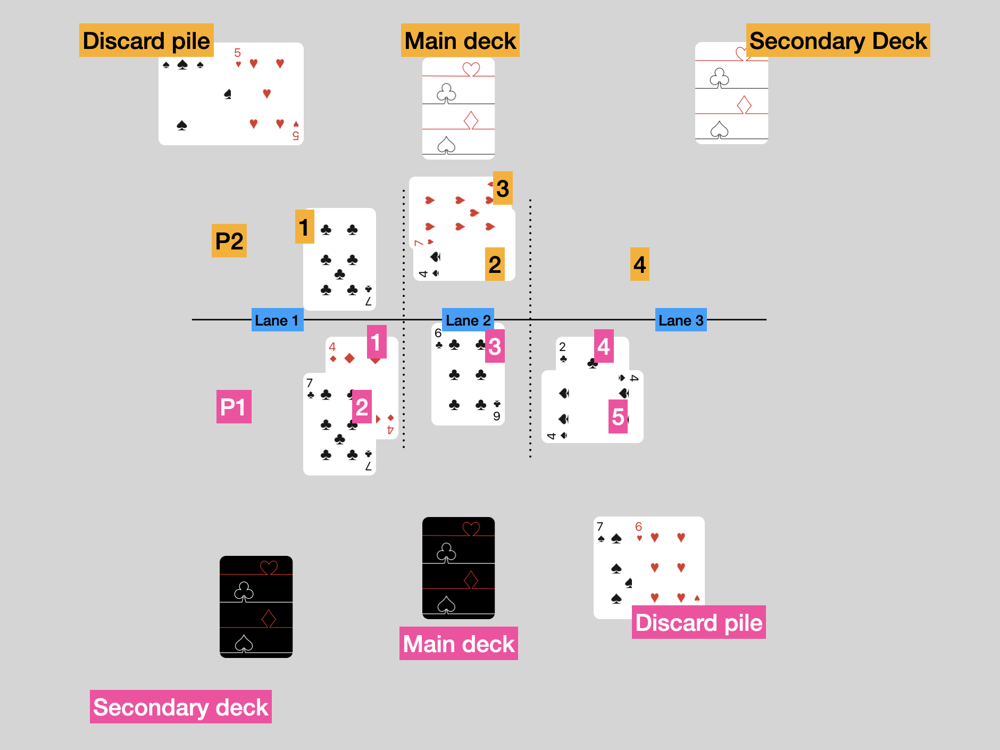

# Rules Book

## Setup
You would need one deck of cards for each player.

From a standard deck of playing cards, remove all the court cards and jokers. Shuffle the deck and deal a deck of 24 cards in front of you: this one will be your main deck. Keep the remaining 16 cards on the side for a moment: this is your side deck.

Before start to play, check your main deck: you can swap up to 3 cards with your side deck.

You are allowed to shuffle the whole 40 card once.

Once you are happy, pick which [powers](./Potere%20dei%20Semi.md) you want to assign to your suits.

!!! note "Alternative modes"
    If you prefer build your own deck or you have only one deck of cards, check out these [variations](#game-variants).

## Quick overview
Cards have face value, from 1 (ace) to 10. When you play cards, their value is added up: the aim is to have an higher score than the opponent without busting.

The game is played across 3 lanes: try to beat the opponent score on each lane to gain points.

## Layout and turns

Keep your main deck always in front of you; discarded cards goes on your right and keep the left side free to build your secondary deck. We don't need the side deck anymore, so you can put it away.

There are 15 turns in each game (check out [how to win](#how-to-win)). Players alternate who goes first. P1 is the first player to start the game; P1 will be always first on odd turns, whereas P2 will go always first on even turns.

Each turns has the **placing** (🎴) phase; then, there are combat (⚔️) phases and moving (🔁) phases. For more info, check the [phases of play](#phases-of-play).

|   Turn | Starting player - Phases   |
| -----| ------------ |
| `1`| P1  -  🎴 |
| `2`| P2  -  🎴 |
| `3`| P1  -  🎴 |
| `4`| P2  -  🎴 > ⚔️   |
| `5`| *(opening Lane 3)* P1  -  🎴   |
| `6`| P2   -  🎴 > ⚔️ > 🔁    |
| `7`| P1  -  🎴 |
| `8`| P2  -  🎴 > ⚔️ |
| `9`| P1  -  🎴 > 🔁 |
| `10`| P2  -  🎴 > ⚔️ |
| `11`| P1  -  🎴 |
| `12`| P2  -  🎴 > ⚔️ > 🔁 |
| `13`| P1  -  🎴 > ⚔️ > 🔁 |
| `14`| P2  -  🎴 > ⚔️ > 🔁 |
| `15`| P1  -  ⚔️ |
| ...| P1/P2  -  🎴 > ⚔️ > 🔁  |

## Lanes and lane's target
The game is played across three lanes, lane 1, lane 2 e lane 3. As per layout, the lane 1 is always the one at the left of player 1 (P1) and lane 2 is always in the middle.

Until fifth turn, you can only play cards on lane 1 and lane 2; lane 3 opens at the end of fourth turn.

Each lane has its own target value; at the beginning of the game all lanes have 21 as target value.

It is crucial to keep track of the score of your lane because during the combat phase you could bust if your score is greater than the target score.

!!! warning "Warning"
    There are powers like [♣️ Inflation](./Potere%20dei%20Semi.md/#c4-inflation) that modify the lane's target value. Watch out!

There is no limit of cards per lane.

## How to win
The player who wins is the one who:

- reaches 15 points first
- has more point at the end of the 15th turn

If both players have more 15 points before the 15th turn, the players who reaches them first wins. If players got the same points (eg. 17 v 17), the game continues as per normal until the draw resolves.

If there is a draw at the end of the 15th turn, keep of playing with turns that have three phases (placing, combat, moving) until the draw resolves.

## Phases of Play
There are three different phases of play across the 15 turn of play. They are played in this order

- Placing
- Combat
- Moving

Placing phase it is always at the beginning of each turn, with players alternating on who goes first (P1 and P2)

First combat phase is at turn 4 and then every two turns (4,6,8,...).

First moving phase is at turn 6 and then ever three turns (6,9,12...)

On turn 12,13,14, all three phases are played following the before mentioned order.

On turn 15 there is only the combat phase.

Here the chronological order of phases and their sub-phases:

1. **Placing**
    1. Draw a card
    2. Play a card on a lane
    3. Discard a card
    4. Place a card in the secondary deck
    5. Reveal the played cards
 1. Resolution of effect (if present)
2. **Combat**
    1. Entering the combat
    2. Score calculation
 1. Effects calculation
 2. Sum lanes' score
 3. Bust checks
    4. End of combat
    5. Scoring points
3. **Moving**
    1. Choosing cards
    2. Revealing cards
    3. Moving cards

### Placing

#### Draw and playing cards
At the beginning of each turn, players draw three cards. Players alternate who goes first (P1 and P2). Then P1 places a card face down on a lane; P2 does the same action; players are free to place the card on any available lane. Once both cards are placed, players discard a card and put the last drawn card in the secondary deck.

If a player cannot place a card in any lane, that card goes in the discard pile.

As long as there are cards in the main deck, players must drawn three cards; if they draw less cards, the cards must be played in this order: Lane > Discard > Secondary Deck.

If at the beginning of the turn a player has 0 cards in the main deck, he must choose between:

- Moving the secondary deck to the main deck position: now the secondary deck is the main deck.
- Shuffle the secondary deck with the discard pile and create a new main deck.

#### Revealing cards
Cards played face down on lanes are revealed simultaneously. If cards have powers, they are resolved now.

If two cards have contrasting effects, like [♦️Pillar](./Potere%20dei%20Semi.md/#d3-pillar) e [♠️Guillotine](./Potere%20dei%20Semi.md/#s3-guillotine), activate first the card of the player that:

- has the lane score closer to the target score without considering the card just revealed. For instance, if target score is 21 and the sum of P1 cards is 17 and P2 is 20, P2's card activate first. If there is a draw:

- activate the card of the player closer to the target score also considering the card just revealed. If there is still a draw:

- both cards are deemed neutral and their effect is not activated.

If during the resolution of the conflict one player's score is over the lane target, that player cannot activate the power of the card.
If both players are over the lane target, both cards are deemed neutral and their effect is not activated.

### Combat
First combat happens at the end of fourth turn and every other 2 turns. You always have a combat phase on turn 13 and 15.

!!! Warning "Order matters"
    Even if the combat phase is quick (both players sum the values of their card and check who is closer to the lane's target without busting), it is important to follow the sequence described [above](#phases-of-play).
    For instance, the power [❤️Parachute](./Potere%20dei%20Semi.md/#h2-parachute) activates when entering the combat meanwhile [Second Chance](#./Potere%20dei%20Semi.md#h4-second-chance) activates only when you bust.

#### Scoring points
Starting from lane 1, players resolve any effect and then they sum the values of their own cards: the players that is closer to the lane's target without busting wins.

- Who wins a lane, gains a point
- If the score is equal to the lane's target, gain 2 points.
- If players draw, one point each
- If a player busts, the other player gains an extra point

You score points at the end of the combat, not lane by lane.

### Moving phase
The first moving phase happens at the end of the sixth turn; then every other 3 turn (9,12,...). There is always a moving phase on turn 13 and 14.

This phase allows players to swap the position of two of their cards.

First, players picks in secret two (or more) cards from their discard pile: the value of these card represent the [position of the card](../assets/ordine-en.png) on the table. For instance, if a player picks 3❤️ and 5♣️, cards in position 3 and 5 swap their positions (if we look at the example picture, 6♣️ and 4♠️ change position).

!!! Note "Cards' position"
    Starting from lane 1, cards are counted top to bottom, and left to right when moving from lane to lane.

To swap cards in position 11 or higher, players may sum the value of 2 cards.

Once the cards are secretly picked, players revels them at the same time and they proceed to swap the cards on their side. You cannot swap position of the opponent's card during this phase.

The cards picked to indicate the positions are placed back into the discard pile.

If a player does not want to swap cards, he can:

- pick two card with the same value, or
- pick a card that indicates a position that does not exist; for instance, 10♦️ and 3♠️ are picked when that player has only 6 cards on the table (therefore, position goes up to 6 only and 10 does not exist)

### Clarifications on the game phases
You can bust only during combat phase; can have any score during the other phases without busting.

Moving phase is always after combat phase.

## Game variants
Here some game variants; maybe you like to create your own deck to play or you have only one pack of cards.

### Deckbuilding
To create your own deck, follow these guidelines:

- a deck must have 24 cards. There is no side-deck
- only unique cards (e.g. cannot have two 2❤️)
- max 1 *poker* (4 cards with the same value)
- max 6 *tris* (3 cards with the same value)
- all four suits must be present
    - pick one and only power for each suit

### Draft
If you like drafting, you can play with just one deck: place all the cards from 1 to 10 on the table. You can create token to represent suits' power.

Each turn a player can:

- pick 2 cards
- pick one power

Also here must follow some guidelines:

- each deck must have 20 cards
- max 1 *poker* (4 cards with the same value)
- all four suits must be present
    - pick one and only power for each suit

Once decks and powers are drafted, you can start to play.
