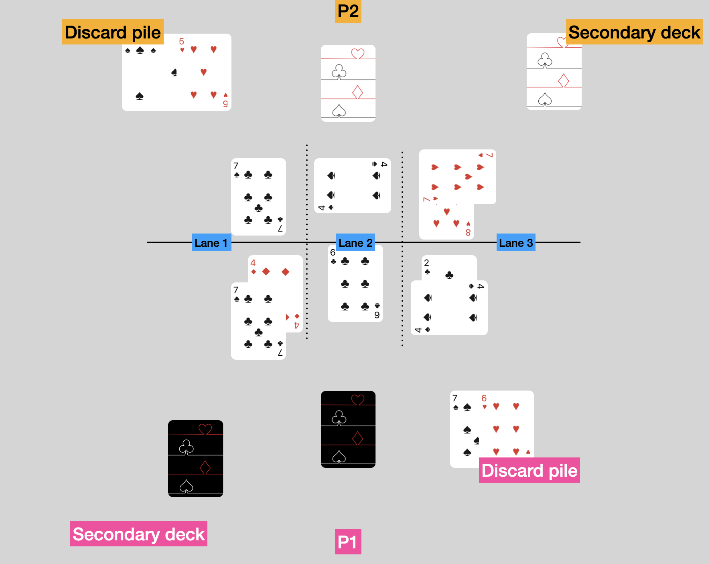

# Rules Book

## Setup
You will need one deck of cards for each player.

From a standard deck of playing cards, remove all the court cards and jokers. Shuffle the deck and deal a deck of 24 cards in front of you: this will be your main deck. Keep the remaining 16 cards on the side for a moment: this is your side deck.

Before starting to play, check your main deck: you can swap up to 3 cards with your side deck.

You are allowed to shuffle and deal the entire 40-card pool again once.

Once you are satisfied, pick which [powers](./Potere%20dei%20Semi.md) you want to assign to each of your suits.

!!! note "Alternative modes"
    If you prefer to build your own deck or you have only one deck of cards, check out these [variations](#game-variants).

## Quick overview
Cards have a face value from 1 (Ace) to 10. When you play cards, their values are added up: the aim is to have a higher score than your opponent without busting.

The game is played across 3 lanes: try to beat the opponent's score in each lane to gain points.

## Layout and turns

Keep your main deck always in front of you; discarded cards go on your right and keep the left side free to build your secondary deck. You don't need the side deck anymore, so you can put it away.

There are 15 turns in each game (check out [how to win](#how-to-win)). Players alternate who goes first. P1 is the first player to start the game; P1 will always be first on odd turns, whereas P2 will always go first on even turns.

Each turn has a **placing** (🎴) phase; then, there are combat (⚔️) phases and movement (🔁) phases. For more info, check the [phases of play](#phases-of-play).

|   Turn | Starting player - Phases   |
| -----| ------------ |
| `1`| P1  -  🎴 |
| `2`| P2  -  🎴 |
| `3`| P1  -  🎴 |
| `4`| P2  -  🎴 > ⚔️   |
| `5`| *(opening Lane 3)* P1  -  🎴   |
| `6`| P2   -  🎴 > ⚔️ > 🔁    |
| `7`| P1  -  🎴 |
| `8`| P2  -  🎴 > ⚔️ |
| `9`| P1  -  🎴 > 🔁 |
| `10`| P2  -  🎴 > ⚔️ |
| `11`| P1  -  🎴 |
| `12`| P2  -  🎴 > ⚔️ > 🔁 |
| `13`| P1  -  🎴 > ⚔️ > 🔁 |
| `14`| P2  -  🎴 > ⚔️ > 🔁 |
| `15`| P1  -  ⚔️ |
| ...| P1/P2  -  🎴 > ⚔️ > 🔁  |

## Lanes and lane targets
The game is played across three lanes: Lane 1, Lane 2, and Lane 3. As shown in the layout, Lane 1 is always the one to the left of Player 1 (P1) and Lane 2 is always in the middle.

Until the fifth turn, you can only play cards in Lane 1 and Lane 2; Lane 3 opens at the end of the fourth turn.

Each lane has its own target value; at the beginning of the game, all lanes have 21 as their target value.

It is crucial to keep track of the score of your lane because during the combat phase you could bust if your score is greater than the target score.

!!! warning "Warning"
    There are powers like [♣️ Inflation](./Potere%20dei%20Semi.md/#c4-inflation) that modify a lane's target value. Watch out!

There is no card limit per lane.

## How to win
The winner is the player who:

- reaches 15 points first
- has more points at the end of the 15th turn

If both players reach more than 15 points before the 15th turn, the player who reached 15 first wins. If players have tied points (e.g., 17 vs. 17), the game continues as normal until the tie is broken.

If there is a draw at the end of the 15th turn, continue playing turns with all three phases (placing, combat, movement) until the tie is broken.

## Phases of Play
There are three different phases of play across the 15 turns. They are played in this order:

- Placing
- Combat
- Moving

The Placing phase is always at the beginning of each turn, with players alternating who goes first (P1 and P2).

The first combat phase occurs on turn 4 and every two turns thereafter (4, 6, 8, ...).

The first movement phase occurs on turn 6 and every three turns thereafter (6, 9, 12, ...).

On turns 12, 13, and 14, all three phases are played following the order mentioned above.

On turn 15, there is only a combat phase.

Here is the chronological order of phases and their sub-phases:

1. **Placing**
    1. Draw a card
    2. Play a card on a lane
    3. Discard a card
    4. Place a card in the secondary deck
    5. Reveal the played cards
    6. Resolution of effects (if present)
2. **Combat**
    1. Entering combat
    2. Score calculation
    3. Effects calculation
    4. Sum lanes' scores
    5. Bust checks
    6. End of combat
    7. Scoring points
3. **Moving**
    1. Choosing cards
    2. Revealing cards
    3. Moving cards

### Placing

#### Drawing and playing cards
At the beginning of each turn, players draw three cards. Players alternate who goes first (P1 and P2). Then P1 places a card face down on a lane; P2 does the same; players are free to place their card on any available lane. Once both cards are placed, players discard a card and put their last drawn card into their secondary deck.

If a player cannot place a card on any lane, that card goes into the discard pile.

As long as there are cards in the main deck, players must draw three cards; if they draw fewer cards, the cards must be played in this order: Lane > Discard > Secondary Deck.

If at the beginning of the turn a player has 0 cards in their main deck, they must choose between:

- Moving the secondary deck to the main deck position: now the secondary deck becomes the main deck.
- Shuffling the secondary deck with the discard pile to create a new main deck.

#### Revealing cards
Cards played face down on lanes are revealed simultaneously. If cards have powers, they are resolved now.

If two cards have conflicting effects, like [♦️Pillar](./Potere%20dei%20Semi.md/#d3-pillar) and [♠️Guillotine](./Potere%20dei%20Semi.md/#s3-guillotine), first resolve the card of the player who:

- has a lane score closer to the target score, not counting the card just revealed. For instance, if the target score is 21, the sum of P1's cards is 17, and P2's is 20, P2's card activates first. If there is a tie:

- resolve the card of the player closer to the target score, also counting the card just revealed. If there is still a tie:

- both cards are deemed neutral and their effects do not activate.

If during the resolution of a conflict one player's score goes over the lane target, that player cannot activate the power of their card.
If both players are over the lane target, both cards are deemed neutral and their effects do not activate.

### Combat
The first combat phase takes place at the end of the fourth turn and every 2 turns thereafter. You always have a combat phase on turns 13 and 15.

!!! Warning "Order matters"
    Even if the combat phase is quick (both players sum the values of their cards and check who is closer to the lane's target without busting), it is important to follow the sequence described [above](#phases-of-play).
    For instance, the power [❤️Parachute](./Potere%20dei%20Semi.md/#h2-parachute) activates when entering combat, whereas [Second Chance](#./Potere%20dei%20Semi.md#h4-second-chance) activates only when you bust.

#### Scoring points
Starting from Lane 1, players resolve any effects and then sum the values of their own cards: the player who is closer to the lane's target without busting wins.

- The winner of a lane gains 1 point.
- If your score is equal to the lane's target, gain 2 points.
- If players tie, they receive 1 point each.
- If a player busts, the other player gains an extra point.

You score points at the end of the combat phase, not lane by lane.

### Moving phase
The first movement phase happens at the end of the sixth turn, and every 3 turns thereafter (9, 12, ...). There is always a movement phase on turns 13 and 14.

This phase allows players to swap the positions of two of their cards.

First, players secretly pick two (or more) cards from their discard pile: the values of these cards represent the [positions of the cards](../assets/ordine-en.png) on the table. For instance, if a player picks 3❤️ and 5♣️, cards in positions 3 and 5 swap their positions (if we look at the example picture, 6♣️ and 4♠️ change positions).

!!! Note "Card positions"
    Starting from Lane 1, cards are counted top to bottom, and left to right when moving from lane to lane.

To swap cards in position 11 or higher, players may sum the values of 2 cards.

Once the cards are secretly picked, players reveal them at the same time and proceed to swap the cards on their side. You cannot swap the positions of the opponent's cards during this phase.

The cards picked to indicate positions are placed back into the discard pile.

If a player does not want to swap cards, they can:

- pick two cards with the same value, or
- pick a card that indicates a position that does not exist; for instance, 10♦️ and 3♠️ are picked when that player has only 6 cards on the table (therefore, positions only go up to 6, and position 10 does not exist).

### Clarifications on the game phases
You can only bust during the combat phase; you can have any score during the other phases without busting.

The movement phase is always after the combat phase.

## Game variants
Here are some game variants if you prefer to create your own deck to play or if you have only one pack of cards.

### Deckbuilding
To create your own deck, follow these guidelines:

- A deck must have 24 cards. There is no side deck.
- Only unique cards are allowed (e.g., you cannot have two 2❤️ cards).
- Max 1 four-of-a-kind (4 cards of the same value).
- Max 6 three-of-a-kinds (3 cards of the same value).
- All four suits must be present.
    - Pick one and only one power for each suit.

### Draft
If you like drafting, you can play with just one deck: place all the cards from 1 to 10 on the table. You can create tokens to represent suit powers.

Each turn a player may:

- pick 2 cards
- pick one power

Drafting must also follow these guidelines:

- Each deck must have 20 cards.
- Max 1 four-of-a-kind (4 cards of the same value).
- All four suits must be present.
    - Pick one and only one power for each suit.

Once decks and powers are drafted, you can start playing.